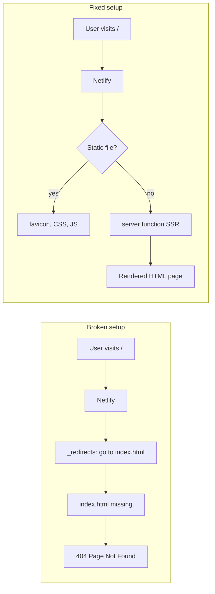

# Step-by-Step: Fix Netlify 404 (Beginner Guide)

This guide explains what we did on **Aspen Oak** and how you can repeat the process on other projects.

---

## Part 1: Understand why you got a 404

Netlify serves **files** from your **publish folder** (e.g. `dist/client`). A 404 means: *“Netlify looked for a file at this URL and did not find it.”*

Your project is **not** a simple static site. It uses **TanStack Start**, which means:

| What you might expect | What actually happens |
|----------------------|------------------------|
| Build creates `index.html` | Build creates **JS/CSS/images** in `dist/client` only |
| Opening `/` serves `index.html` | Opening `/` needs a **server** to render HTML (SSR) |
| `_redirects` → `/index.html` works | That redirect points to a **file that does not exist** → 404 |



**Takeaway for beginners:** Before changing config, ask: *“Does my build output include an `index.html` at the root of the publish folder?”*  
- **Yes** → you likely have a static site or SPA (different steps below).  
- **No** → you need SSR/server support (TanStack Start, Next.js-style apps).

---

## Part 2: What we changed on Aspen Oak (5 steps)

### Step 1 — Confirm the problem locally

After building, look inside the publish folder:

```bash
npm run build
ls dist/client
```

On your project we saw: `assets/`, `favicon.ico` — **no `index.html`**. That confirmed static-only deploy would fail.

---

### Step 2 — Install the official Netlify plugin for TanStack Start

TanStack Start needs Netlify to run a **serverless function** that renders pages. The plugin wires that up automatically at build time.

```bash
npm install -D @netlify/vite-plugin-tanstack-start
```

This was added to [`package.json`](package.json) as a dev dependency.

---

### Step 3 — Add the plugin to Vite

In [`vite.config.ts`](vite.config.ts):

1. Import the plugin:
   ```ts
   import netlify from "@netlify/vite-plugin-tanstack-start";
   ```
2. Add `netlify()` to the `plugins` array (after `tanstackStart()`, before or after `react()` is fine):
   ```ts
   plugins: [
     // ...other plugins
     tanstackStart({ server: { entry: "server" } }),
     netlify(),  // <-- this line
     react(),
   ],
   ```

**What this does:** On `npm run build`, you should see a log like:

```text
Netlify ✓ Wrote SSR entry point to .netlify/v1/functions/server.mjs
```

That file tells Netlify how to run your server code in production.

---

### Step 4 — Configure `netlify.toml`

Create or update [`netlify.toml`](netlify.toml) at the project root:

```toml
[build]
  command = "npm run build"
  publish = "dist/client"

[dev]
  command = "npm run dev"
  port = 3000
```

| Setting | Meaning |
|---------|---------|
| `command` | What Netlify runs on each deploy |
| `publish` | Folder Netlify serves static files from |
| `[dev]` | Optional: local dev settings when using Netlify CLI |

**Important:** In the Netlify dashboard, these must **match** `netlify.toml` (or delete dashboard overrides so the file wins).

---

### Step 5 — Remove the wrong SPA redirect

We deleted [`public/_redirects`](public/_redirects) because it contained:

```text
/*    /index.html   200
```

That rule is for **Create React App / Vite SPA** sites that **do** ship an `index.html`. For TanStack Start SSR, it **breaks** deploys by sending every URL to a missing file.

We also added `.netlify/` to [`.gitignore`](.gitignore) so local Netlify cache/DB files are not committed.

---

### Step 6 — Deploy again

1. Commit and push your changes, **or**
2. Run: `npx netlify deploy --prod` (after `netlify link` or `netlify init`)

Use **Netlify CLI 17.31+** for TanStack Start.

In the dashboard: **Deploys → Trigger deploy → Clear cache and deploy site** (helps if an old broken build was cached).

---

## Part 3: How to apply this to *other* projects

### If the project is **TanStack Start** (like Aspen Oak)

Follow **all steps in Part 2**. Checklist:

- [ ] `@netlify/vite-plugin-tanstack-start` installed
- [ ] `netlify()` in `vite.config.ts`
- [ ] `publish = "dist/client"` in `netlify.toml`
- [ ] No `public/_redirects` pointing to `index.html` (unless you know you have that file)
- [ ] Build log shows SSR entry point written

Official docs: [TanStack Start on Netlify](https://docs.netlify.com/build/frameworks/framework-setup-guides/tanstack-start/)

---

### If the project is a **plain Vite + React SPA** (React Router, no TanStack Start)

You **do** need `index.html`. Typical setup:

1. **Publish folder:** usually `dist` (not `dist/client`)
2. **Add** SPA redirect — either `public/_redirects`:
   ```text
   /*    /index.html   200
   ```
   or in `netlify.toml`:
   ```toml
   [[redirects]]
     from = "/*"
     to = "/index.html"
     status = 200
   ```
3. **Do not** install `@netlify/vite-plugin-tanstack-start` (not needed)

Verify: after `npm run build`, `dist/index.html` **exists**.

---

### If the project is **Next.js, Nuxt, etc.**

Each framework has its own Netlify adapter. Search: `"<framework name> deploy netlify"` and use the official guide — do not copy the TanStack Start plugin blindly.

---

## Part 4: Quick troubleshooting (beginner)

| Symptom | Likely cause | Fix |
|---------|--------------|-----|
| Netlify “Page not found” on `/` | Wrong publish dir or missing server plugin | Check `publish` path; for TanStack Start, add `netlify()` plugin |
| 404 only on `/about`, `/contact` | Missing SPA redirect (static SPA only) | Add `_redirects` or `[[redirects]]` to `index.html` |
| 404 on every route including `/` | `_redirects` to `index.html` but no `index.html` | Remove `_redirects` (SSR apps) or fix build to emit `index.html` |
| Works locally, fails on Netlify | Dashboard build settings differ from `netlify.toml` | Align settings or clear cache redeploy |
| Build succeeds, still 404 | Old deploy cached | Clear cache and redeploy |

---

## Part 5: Mental model to remember

1. **Build** → produces files in a folder  
2. **Publish** → Netlify serves that folder  
3. **Redirects / functions** → tell Netlify what to do when a file is missing  
4. **SSR apps** → HTML is generated at request time; you need a **function**, not just `index.html`  
5. **SPA apps** → one `index.html` + redirect all routes to it  

Your Aspen Oak fix was: **stop treating an SSR app like a static SPA**, add the **Netlify TanStack plugin**, and **remove the misleading `_redirects` file**.

---

## Files changed in this project (reference)

| File | Change |
|------|--------|
| [`vite.config.ts`](vite.config.ts) | Added `import netlify` and `netlify()` plugin |
| [`netlify.toml`](netlify.toml) | Build command + `publish = "dist/client"` |
| [`package.json`](package.json) | Added `@netlify/vite-plugin-tanstack-start` |
| `public/_redirects` | **Deleted** (was causing 404) |
| [`.gitignore`](.gitignore) | Added `.netlify/` |

No code changes were needed in your React components — this was **deployment configuration only**.
